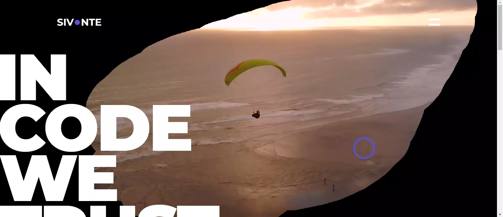

<h1 align="center">Portfolio</h1>

<p align="center">


</p>

## About The Project

I built this website in Gatsby.js.
The MobX library was used to manage the state of the application,
while Styled Components and Framer Motion were used for page styling and animations.
Application pages are dynamically created by GraphQL queries that retrieve data from markdown files.
Also, like all my React projects, this one is built with TypeScript to write safer and better code.

<br/>

<p align="center">
  
</p>

## Features

- Dark and light theme,
- Canvas eraser effect ,
- Custom cursor,
- Markdown files as a source content.

## Built With

| Application                                         | Infrastructure                                                    |
|-----------------------------------------------------|-------------------------------------------------------------------|
| [GatsbyJS v5](https://www.gatsbyjs.com/)            | [Azure](https://azure.microsoft.com/en-us/)                       |
| [MobX](https://mobx.js.org/README.html)             | [GitHub](https://github.com/)                                     |
| [TypeScript](https://www.typescriptlang.org/)       | [GitHub Actions](https://docs.github.com/en/actions)              |
| [GraphQL](https://graphql.org/)                     | [Terraform](https://developer.hashicorp.com/terraform)            |
| [Markdown](https://www.markdownguide.org/)          | [Terraform Cloud](https://cloud.hashicorp.com/products/terraform) |
| [Styled Components](https://styled-components.com/) | [OVH](https://www.ovhcloud.com)                                   |
| [Framer Motion](https://www.framer.com/api/)        | [diagrams.net](https://www.diagrams.net/)                         |
| [IcoMoon](https://icomoon.io/)                      |                                                                   |
| [Eslint](https://eslint.org/)                       |                                                                   |
| [Prettier](https://prettier.io/)                    |                                                                   |

## Local launch

### Prerequisites

- Node.js v18.

### Installation

1. **Navigate into your project root directory and run the following command to download packages:**

```shell
npm install
```

2. **Start the development environment:**

```shell
gatsby develop
```

Your site is now running at `http://localhost:8000`.

## Infrastructure Architecture


### Infrastructure Resources

- Azure Service Principal - Terraform Cloud to Azure authentication,
- Azure Resource Group - a container for Azure resources,
- Azure DNS Zones - domain hosting and management,
- Azure Static Web App - web hosting for static site `.\gatsby-app`,
- Terraform Cloud - remote state management of infrastructure,
- OVH - domain registration,
- GitHub / GitHub Actions - git repository and CI/CD tool.

## Deployment Architecture


### Application Deployment

1. Connect Terraform Cloud to Azure using a [Azure Service
   Principal with a Client Secret](https://registry.terraform.io/providers/hashicorp/azurerm/latest/docs/guides/service_principal_client_secret)
   .
    - register an application with Azure AD and create a Service Principal using
      the [Azure Portal](https://learn.microsoft.com/en-us/azure/active-directory/develop/howto-create-service-principal-portal)
      or [Azure PowerShell](https://learn.microsoft.com/en-us/azure/active-directory/develop/howto-authenticate-service-principal-powershell)
      ,
    - assign a `Contributor` role to the application,
    - create a application secret and copy it,
    - create a workspace in Terraform Cloud with `API-driven workflow`,
    - create variables in workspace:
        - `ARM_SUBSCRIPTION_ID` - the ID of the Azure Subscription where resources will be created,
        - `ARM_TENANT_ID` - this is the Azure Directory (tenant) ID of the Service Principal,
        - `ARM_CLIENT_ID` - this is the Application (client) ID of the Service Principal,
        - `ARM_CLIENT_SECRET` - mark as sensitive, this is the secret password for the Service Principal.
2. Connect Terraform Cloud
   to [GitHub Actions](https://developer.hashicorp.com/terraform/tutorials/automation/github-actions).
    - create API token in Terraform Cloud,
    - in your repository create a secret named TERRAFORM_CLOUD_API_TOKEN, setting the Terraform Cloud API.
3. Buy a domain e.g. at OVH.
4. In `.\infrastructure\azure\env\prod.tfvars` set your domain name.
   ```terraform
      dns_zone_name = "sivonte.com"
   ```
5. Run `Deploy Infrastructure to Azure` workflow in GitHub Actions.
6. The first run will fail because you need to
    - [delegate your domain to Azure](https://learn.microsoft.com/en-us/azure/dns/dns-delegate-domain-azure-dns) - on
      the DNS management page of your existing registrar provider, replace the DNS server records
      with name servers that you created in the previous step in the Azure DNS Zones,
    - in your repository create a secret named AZURE_STATIC_WEB_APPS_API_TOKEN, setting the Static Web App (created in
      the previous step) `Deployment token`.
7. Run `Deploy Infrastructure to Azure` again.

## License

This project is licensed under the MIT License.

## Contact

**Krzysztof Talar** - [Linkedin](https://www.linkedin.com/in/ktalar/) - krzysztof.talar@protonmail.com
